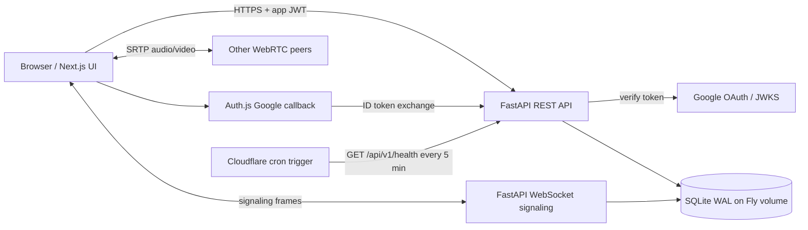
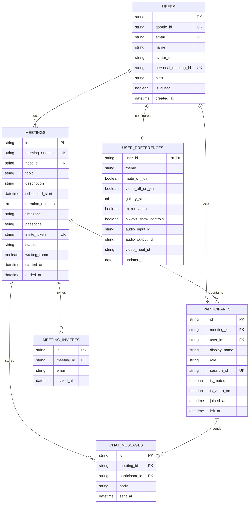

# Zoom Workplace Clone

A full-stack Zoom-inspired video-conferencing application built for the Scaler SDE Fullstack assignment. Instant and scheduled meetings, guest invite links, persistent chat, real WebRTC audio/video, host controls, Google OAuth, and a responsive Zoom-style desktop shell.

## Live

| | |
|---|---|
| **App** | <https://zoom-clone.pinakkundu1080.workers.dev> |
| **API** | <https://zoom-clone-api.fly.dev> |
| **Health** | <https://zoom-clone-api.fly.dev/api/v1/health> |
| **Source** | <https://github.com/pinakkk/scaler-submission> |

Frontend on Cloudflare Workers (OpenNext), backend on Fly.io (`sin`) with a persistent SQLite volume. Deployment steps: [`deployment.md`](deployment.md).

### Trying it out

Open a meeting and use **Copy invite link** in the room top bar. The link carries `?pwd=<invite_token>`, so the recipient joins by entering a display name — no account and no passcode needed. Signing in with Google is optional and only required to host or schedule.

## Features

- [x] Zoom-style dashboard with profile, account, navigation, and Settings
- [x] Instant meetings with unique 11-digit IDs, passcodes, and invite links
- [x] Join by meeting ID or invite URL, with guest display-name entry
- [x] Meeting existence and passcode validation without leaking private fields
- [x] Scheduled meetings with title, description, start time, duration, timezone
- [x] Upcoming/day and previous-meeting views backed by SQLite
- [x] Idempotent seed data
- [x] WebSocket signaling and full-mesh WebRTC audio/video
- [x] Persistent in-meeting chat and participant lifecycle
- [x] Host mute-all, remove-participant, and end-for-all controls
- [x] Google OAuth with server-side ID-token verification; guest joining stays login-free
- [x] Responsive rail/bottom navigation and meeting grid
- [x] Marketing landing page and Settings modal (General, Video, Audio, Background, About)

## Tech stack

| Layer | Technology | Why |
|---|---|---|
| Frontend | Next.js 16, React 19, TypeScript | App Router, typed components, server/client boundaries |
| Styling | Tailwind CSS 4 + CSS design tokens | Responsive composition with a centralized visual system |
| Server state | TanStack Query | Cached REST reads and mutation invalidation |
| Room state | Zustand | Narrow, high-frequency subscriptions for media/participant state |
| Auth | Auth.js v5 + Google OAuth | Standard OAuth callback handling with JWT sessions |
| API | FastAPI + Pydantic | Typed contracts, dependency injection, async WebSocket support |
| Data | SQLModel + SQLite WAL | Explicit relational schema in a compact database |
| Realtime | WebSocket signaling + WebRTC mesh | Peer-to-peer media without an out-of-scope SFU |
| Testing | pytest, Vitest, Testing Library | 217 API tests, 138 frontend tests |
| Hosting | Cloudflare Workers/OpenNext + Fly.io | Edge frontend, persistent Python/SQLite/WebSocket backend |

## Architecture



The browser calls FastAPI directly — Next.js does not proxy API traffic, avoiding an extra hop and preserving WebSocket behavior. Auth.js handles the Google redirect; FastAPI verifies the ID token and issues the bearer token used by all application APIs. A Cloudflare cron pings the health endpoint every 5 minutes so the Fly machine never cold-starts mid-demo.

### Identity model

Three ways in, by design:

1. **Google OAuth** — full account. Can host, schedule, and use host controls.
2. **Guest** — `POST /auth/guest` mints a real user row with `is_guest=true` and a 4-hour token. Can join and chat; cannot list or schedule meetings (`GUEST_FORBIDDEN`).
3. **Invite link** — `?pwd=<invite_token>` stands in for the passcode, so a shared URL is self-contained.

## Database schema



Indexes cover meeting-number/invite lookup, host upcoming/recent queries, active participants, and chronological chat. SQLite enables foreign keys, WAL, a 5-second busy timeout, and `synchronous=NORMAL` on every connection.

## Local setup

Requires Python 3.12+, Node.js 20+, and two browser profiles for multi-peer testing.

### 1. API

```bash
cd api
python3 -m venv .venv
source .venv/bin/activate
python -m pip install -e '.[dev]'
cp .env.example .env
python -m app.seed
uvicorn app.main:app --reload --host 127.0.0.1 --port 8000
```

API at <http://localhost:8000>, docs at <http://localhost:8000/docs> (hidden in production).

### 2. Web

In a second terminal:

```bash
cd web
npm ci
cp .env.example .env.local
npm run dev
```

Open <http://localhost:3000>. The template ships `NEXT_PUBLIC_AUTH_MODE=dev`, which signs in as the seeded host through a local-only endpoint that FastAPI disables when `ENVIRONMENT=production`.

For real Google OAuth locally, point both apps at the same Google Web client (`AUTH_GOOGLE_ID` in `web/.env.local` must equal `GOOGLE_CLIENT_ID` in `api/.env`), set `NEXT_PUBLIC_AUTH_MODE=google`, and authorize `http://localhost:3000` plus `http://localhost:3000/api/auth/callback/google` in Google Cloud Console.

### Seed data

```bash
cd api
python -m app.seed          # idempotent top-up
python -m app.seed --reset  # destructive reset + reseed
```

Creates one primary host, three secondary users, upcoming and ended meetings with chat history, and one live meeting (`955 1203 8847`) for join testing.

### Validation

```bash
cd api && .venv/bin/pytest && .venv/bin/ruff check app tests
cd ../web && npm run typecheck && npm run lint && npm test -- --run
```

For a media smoke test, open two browser profiles, join the same meeting, and verify remote media, mute-all, participant removal, end-for-all, refresh/rejoin, and denied-camera fallback.

## Environment variables

Three files, all gitignored. `api/.env` and `web/.env.local` are local; `web/.env.production` feeds the deploy build.

### API (`api/.env`)

| Variable | Purpose | Local default |
|---|---|---|
| `ENVIRONMENT` | `local` enables docs and dev auth; `production` hardens both | `local` |
| `DATABASE_URL` | SQLite URL. Production uses four slashes: `sqlite:////data/zoom.db` | `sqlite:///./zoom.db` |
| `CORS_ORIGINS` | Comma-separated allowed frontend origins | `http://localhost:3000` |
| `GOOGLE_CLIENT_ID` | Expected Google ID-token audience | empty for dev auth |
| `SECRET_KEY` | Signs application JWTs | generated per machine |
| `TURN_URLS`, `TURN_USERNAME`, `TURN_CREDENTIAL` | TURN relay; all three or none | empty (STUN-only) |
| `REDIS_URL` | Cache backend seam — phase 2, leave empty | empty |

In production these are split: non-secrets live in `api/fly.toml` under `[env]`, secrets are set with `fly secrets set`.

### Web (`web/.env.local` for dev, `web/.env.production` for deploy)

| Variable | Purpose | Local default |
|---|---|---|
| `NEXT_PUBLIC_API_BASE_URL` | Browser REST base URL | `http://localhost:8000` |
| `NEXT_PUBLIC_WS_BASE_URL` | Signaling WebSocket base URL | `ws://localhost:8000` |
| `NEXT_PUBLIC_AUTH_MODE` | `dev` locally, `google` in production | `dev` |
| `AUTH_GOOGLE_ID`, `AUTH_GOOGLE_SECRET` | Google OAuth Web client | empty in dev mode |
| `AUTH_SECRET` | Auth.js JWT encryption/signing secret | generated per machine |
| `NEXTAUTH_URL` | Canonical frontend origin | `http://localhost:3000` |

> `NEXT_PUBLIC_*` values are compiled into the browser bundle at build time. Next.js loads `.env.local` in every environment except `test`, and it outranks `.env.production` — so `npm run cf:build` passes `.env.production` as real environment variables, which outrank both files. Without that, a production build silently bakes in localhost URLs.

## Design decisions

- **Backend on Fly.io, not Workers.** Cloudflare Workers cannot run a Python FastAPI process or mount SQLite. Fly gives a persistent volume and long-lived WebSockets.
- **Mesh, not SFU.** A media server is out of scope. Full mesh gives real audio/video with a deliberate six-participant cap.
- **Guest join is first-class.** The assignment permits no-login assumptions, so invite links work without Google. Guests get real user rows so `participants.user_id` is always populated.
- **Single API process.** WebSocket room state is in-process; Fly and Uvicorn are pinned to one machine/worker. `min_machines_running = 1` with `auto_stop_machines = false` keeps signaling alive — the machine bills continuously rather than idling to zero.
- **Direct API calls.** The browser reaches FastAPI over CORS instead of routing through Next.js.

## Known limitations

- **TURN is not configured in production**, so connections are STUN-only. Roughly 15–20% of peer pairs behind symmetric NAT will fail to connect over the internet; same-network testing is unaffected. Set all three `TURN_*` secrets to fix.
- Mesh rooms cap at six participants; upload bandwidth grows with every peer.
- Horizontal API scaling requires moving room coordination to Redis pub/sub or a shared signaling layer.
- SQLite suits this single-instance deployment, not a multi-region write workload.
- Browser media autoplay and device-selection behavior varies; Safari may need extra user gestures.

## Repository layout

```text
api/                 FastAPI app, SQLModel models, seed script, tests, Fly config
web/                 Next.js app, WebRTC client, Auth.js, OpenNext/Worker config
docs/BLUEPRINT.md    implementation blueprint and acceptance criteria
deployment.md        Fly.io + Cloudflare + Google OAuth runbook
TASK.md              original assignment
```
