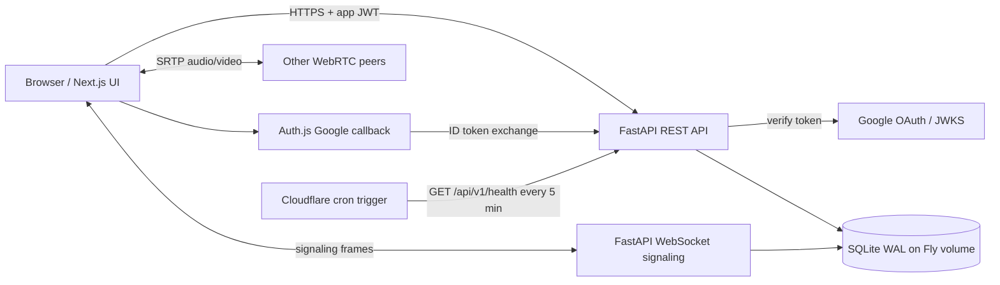

# Zoom Workplace Clone

A full-stack Zoom-inspired video-conferencing application built for the Scaler SDE Fullstack assignment. It supports instant and scheduled meetings, guest invite links, persistent chat, real WebRTC audio/video, host controls, Google OAuth, and a responsive Zoom-style desktop shell.

## Links

- Source: <https://github.com/pinakkk/scaler-submission>
- Frontend: _add the Cloudflare Workers URL after deployment_
- API: _add the Fly.io URL after deployment_
- Deployment runbook: [`deployment.md`](deployment.md)

The repository is deployment-ready, but no live URL is claimed until the account-owned Fly.io and Cloudflare deployment steps have been completed.

## Feature checklist

- [x] Zoom-style dashboard with profile, account, navigation, and Settings entry points
- [x] Instant meetings with unique 11-digit IDs, passcodes, and invite links
- [x] Join by meeting ID or invite URL, including guest display-name entry
- [x] Meeting existence and passcode validation without leaking private fields
- [x] Scheduled meetings with title, description, start time, duration, and timezone
- [x] Upcoming/day and previous-meeting views backed by SQLite
- [x] Demo-ready, idempotent seed data
- [x] WebSocket signaling and full-mesh WebRTC audio/video
- [x] Persistent in-meeting chat and participant lifecycle
- [x] Host mute-all, remove-participant, and end-for-all controls
- [x] Google OAuth with server-side ID-token verification; guest joining remains login-free
- [x] Responsive rail/bottom navigation and meeting grid
- [ ] P14 marketing landing and complete Settings modal

## Tech stack

| Layer | Technology | Why |
|---|---|---|
| Frontend | Next.js 16, React 19, TypeScript | App Router, typed components, server/client boundaries, production bundling |
| Styling | Tailwind CSS 4 + CSS design tokens | Fast responsive composition with a centralized Zoom-inspired visual system |
| Server state | TanStack Query | Cached REST reads and mutation invalidation |
| Room state | Zustand | Narrow, high-frequency subscriptions for media/participant state |
| Authentication | Auth.js v5 + Google OAuth | Standard OAuth callback handling with JWT sessions |
| API | FastAPI + Pydantic | Typed contracts, dependency injection, async WebSocket support |
| Data | SQLModel + SQLite WAL | Explicit relational schema in a compact submission-friendly database |
| Realtime media | WebSocket signaling + WebRTC mesh | Real peer-to-peer media without an out-of-scope SFU |
| Testing | pytest, Vitest, Testing Library | API/service behavior and frontend utility/component coverage |
| Hosting | Cloudflare Workers/OpenNext + Fly.io | Edge-hosted Next.js frontend and a persistent Python/SQLite/WebSocket backend |

## Architecture



The browser calls FastAPI directly. Next.js does not proxy API traffic, avoiding an extra network hop and preserving WebSocket behavior. Auth.js handles the Google redirect, while FastAPI verifies the Google ID token and issues the bearer token used by all application APIs.

## Database schema

```mermaid
erDiagram
    USERS ||--o{ MEETINGS : hosts
    USERS ||--o{ PARTICIPANTS : joins
    USERS ||--o| USER_PREFERENCES : configures
    MEETINGS ||--o{ PARTICIPANTS : contains
    MEETINGS ||--o{ CHAT_MESSAGES : stores
    PARTICIPANTS ||--o{ CHAT_MESSAGES : sends
    MEETINGS ||--o{ MEETING_INVITEES : invites

    USERS {
      string id PK
      string google_id UK
      string email UK
      string name
      string avatar_url
      string personal_meeting_id UK
      string plan
      boolean is_guest
      datetime created_at
    }
    MEETINGS {
      string id PK
      string meeting_number UK
      string host_id FK
      string topic
      string description
      datetime scheduled_start
      int duration_minutes
      string timezone
      string passcode
      string invite_token UK
      string status
      boolean waiting_room
      datetime started_at
      datetime ended_at
    }
    PARTICIPANTS {
      string id PK
      string meeting_id FK
      string user_id FK
      string display_name
      string role
      string session_id UK
      boolean is_muted
      boolean is_video_on
      datetime joined_at
      datetime left_at
    }
    CHAT_MESSAGES {
      string id PK
      string meeting_id FK
      string participant_id FK
      string body
      datetime sent_at
    }
    MEETING_INVITEES {
      string id PK
      string meeting_id FK
      string email
      datetime invited_at
    }
    USER_PREFERENCES {
      string user_id PK_FK
      string theme
      boolean mute_on_join
      boolean video_off_on_join
      int gallery_size
      boolean mirror_video
      boolean always_show_controls
      string audio_input_id
      string audio_output_id
      string video_input_id
      datetime updated_at
    }
```

Important indexes cover meeting-number/invite lookup, host upcoming/recent queries, active participants, and chronological chat. SQLite enables foreign keys, WAL, a 5-second busy timeout, and `synchronous=NORMAL` on every connection.

## Local setup

### Prerequisites

- macOS/Linux (commands below use a POSIX shell)
- Python 3.12+
- Node.js 20+
- Two modern browsers or browser profiles for multi-peer testing
- Camera/microphone access for media testing

### 1. API

```bash
cd api
python3 -m venv .venv
source .venv/bin/activate
python -m pip install -e '.[dev]'
cp .env.example .env
python -m app.seed
uvicorn app.main:app --reload --host 127.0.0.1 --port 8000
```

The API is available at <http://localhost:8000>, health at <http://localhost:8000/api/v1/health>, and local OpenAPI docs at <http://localhost:8000/docs>.

### 2. Web

In a second terminal:

```bash
cd web
npm ci
cp .env.example .env.local
npm run dev
```

Open <http://localhost:3000>. The checked-in template uses `NEXT_PUBLIC_AUTH_MODE=dev`, which signs in as the seeded host through a local-only API endpoint. FastAPI disables that endpoint when `ENVIRONMENT=production`.

For real local Google OAuth, set both applications to the same Google Web client:

```dotenv
# web/.env.local
AUTH_GOOGLE_ID=<google-web-client-id>
AUTH_GOOGLE_SECRET=<google-web-client-secret>
AUTH_SECRET=<openssl-rand-base64-32-output>
NEXTAUTH_URL=http://localhost:3000
NEXT_PUBLIC_AUTH_MODE=google

# api/.env
GOOGLE_CLIENT_ID=<same-google-web-client-id>
```

Authorize `http://localhost:3000` and `http://localhost:3000/api/auth/callback/google` in Google Cloud Console.

### Seed data

```bash
cd api
source .venv/bin/activate
python -m app.seed          # idempotent top-up
python -m app.seed --reset  # destructive local reset + reseed
```

The seed creates one primary host, three secondary users, two upcoming meetings, three ended meetings with chat history, and one live meeting (`955 1203 8847`) for join testing.

### Validation

```bash
cd api
.venv/bin/pytest
.venv/bin/ruff check app tests

cd ../web
npm run typecheck
npm run typecheck:worker
npm run lint
npm test -- --run
npm run build
npm run cf:build
```

For a real media smoke test, open two browser profiles, join the same live meeting, grant media permissions, and verify remote media, mute-all, participant removal, end-for-all, refresh/rejoin, and denied-camera fallback.

## Environment variables

### API (`api/.env`)

| Variable | Purpose | Local default |
|---|---|---|
| `ENVIRONMENT` | Enables local docs/dev auth or production hardening | `local` |
| `DATABASE_URL` | SQLAlchemy SQLite URL | `sqlite:///./zoom.db` |
| `CORS_ORIGINS` | Comma-separated allowed frontend origins | `http://localhost:3000` |
| `GOOGLE_CLIENT_ID` | Expected Google ID-token audience | empty for dev auth |
| `SECRET_KEY` | Signs application JWTs | local generated value recommended |
| `TURN_URLS`, `TURN_USERNAME`, `TURN_CREDENTIAL` | TURN relay configuration | empty (STUN-only) |
| `REDIS_URL` | Optional cache backend seam | empty |

### Web (`web/.env.local`)

| Variable | Purpose | Local default |
|---|---|---|
| `NEXT_PUBLIC_API_BASE_URL` | Browser REST base URL | `http://localhost:8000` |
| `NEXT_PUBLIC_WS_BASE_URL` | Signaling WebSocket base URL | `ws://localhost:8000` |
| `NEXT_PUBLIC_AUTH_MODE` | `dev` locally, `google` in production | `dev` |
| `AUTH_GOOGLE_ID`, `AUTH_GOOGLE_SECRET` | Google OAuth Web client | empty in dev mode |
| `AUTH_SECRET` | Auth.js JWT encryption/signing secret | generated locally |
| `NEXTAUTH_URL` | Canonical frontend origin | `http://localhost:3000` |

Never commit `.env` or `.env.local`; both are ignored.

## Assumptions and design decisions

- **Backend on Fly.io rather than Workers:** Cloudflare Workers cannot run this Python FastAPI process or mount the required SQLite file. Fly provides a persistent volume and long-lived WebSockets.
- **Mesh rather than SFU:** A media server is outside assignment scope. Full mesh gives real audio/video with a deliberate six-participant cap.
- **Google OAuth is a bonus:** The task allows no-login assumptions, so guest invite links remain fully usable without Google.
- **Single API process:** WebSocket room state is in-process. Fly and Uvicorn are intentionally restricted to one machine/worker.
- **Direct API calls:** The browser calls FastAPI using CORS instead of routing through Next.js.

## Known limitations

- Mesh rooms cap at six participants and upload bandwidth grows with every peer.
- STUN-only connections fail on some corporate/symmetric-NAT networks; configure TURN before an internet demo.
- Horizontal API scaling requires moving room coordination to Redis pub/sub or another shared signaling layer.
- SQLite is appropriate for the single-instance assignment deployment, not a multi-region write workload.
- Browser media autoplay/device-selection behavior varies; Safari may require additional user gestures.
- Live deployment and Google OAuth require account-owned credentials and cannot be verified from source alone.

## Repository layout

```text
api/                 FastAPI app, SQLModel models, seed script, tests, Fly config
web/                 Next.js app, WebRTC client, Auth.js, OpenNext/Worker config
docs/BLUEPRINT.md    implementation blueprint and acceptance criteria
deployment.md         Fly.io + Cloudflare + Google OAuth deployment runbook
TASK.md               original assignment
```
